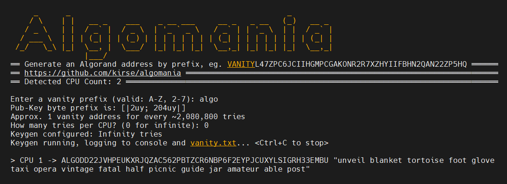

# What is Algomania?

Algomania is the fastest CPU-only vanity address generator for Algorand. It utilizes `libsodium` for ed25519 keypair generation
and produces Algorand account mnemonics only when public key matches are found. For those wanting elite 8-char vanity addresses,
using Algomania is essential. See the [performance table](#performance) for tested keygen speeds.

# How to Build & Use

1. System Requirements (Cross-Platform Supported)

   - [.NET Core](https://dotnet.microsoft.com/en-us/download)
   - **libsodium** - [Windows](https://download.libsodium.org/libsodium/releases/libsodium-1.0.18-stable-msvc.zip) / [Mac](https://formulae.brew.sh/formula/libsodium) / [RHEL](<https://rpmfind.net/linux/rpm2html/search.php?query=libsodium(x86-64)>) / [Ubuntu](https://pkgs.org/download/libsodium23)

1. `git clone https://github.com/kirse/algomania`
1. Update the `DllImport` path in [line 12](https://github.com/kirse/algomania/blob/main/Main.fs#L12) of `Main.fs` to point to your libsodium library (.so, .dll, etc.)

   - If Windows platform, simply copy `libsodium.dll` next to this program, no edits needed.

1. `dotnet run -c Release`

# Optimizing Chances of Winning

Given the math, the best "bang for your buck" is an 8-char vanity prefix (if you have the hardware). Any byte array
of `length mod 5 = 0` exactly specifies a desired Base32 string. What this means is a 7-char prefix
(4 bytes of chance 1/256) \* (1 "pinning" byte of chance 1/32) is about as hard to generate as an 8-char prefix (5 bytes of chance 1/256).

1-3 byte prefixes are easily churnable on commodity hardware. 4-5 bytes should use high performance many-core CPUs. 6+ bytes is uncharted
space and not recommended. 6+ bytes is likely possible with an ed25519 GPU-focused solution (stay tuned).

# Performance

To contribute figures, please PR with a runtime screenshot.

| CPU                                       | RAM   | Keys/Sec | Test Notes          | Platform |
| ----------------------------------------- | ----- | -------- | ------------------- | -------- |
| AMD EPYC 7443P - 2.85/4.0 GHz - 24C/48T   | 256GB | 1.16M    | 11h:26m / 48b tries | Rocky8   |
| Intel E-2288G - 4.0/4.9 GHz - 6C/12T      | 32GB  | 304K     | 10h:58m / 12b tries | Rocky8   |
| Intel Core i7-7500U - 2.7/2.9 Ghz - 2C/4T | 16GB  | 31K      | 8h:30m / 1b tries   | Windows  |

# Misc Links

- Base32 Converters
  - https://cryptii.com/pipes/base32-to-hex
  - https://tomeko.net/online_tools/base32.php?lang=en

# Some Historical Notes

(On trying to generate keys faster)

- First cut is ~1:50/M addresses - 9k/s
- 2nd - remove .NET AlgoSDK, use Bouncy Castle direct = 1:32/M - 10.8k/s
- 3rd - separate fsharp = 1:12/M - 13.8k/s
- 4th - use Array and Array.Parallel.iter = 0:52/M (19.1k/s), 8h/500M (17.3k/s)
- 4th - fresh reboot - 7:35:00/500M (18.3k/s)
- 5th - used .NET TPL - 0:33/M - 30k/s (4 Tasks), 6:50/10M (24.4k/s), 9:21:00/800M (23.8k/s)
- 6th - refactor using TPL + libsodium for keygen - 0:24/M (41k/s), 2:18/5M (36k/s), 8:30/1B (33k/s) dotnet run -c Release
- 7th - tried `span<byte>` + `stackalloc` refactor but same times as round 6
- 8th - cloud 3cpu/9-core box - 0:07/M (143k/s)
- 9th - cloud Bare Metal 6cpu/12-core box -
  - 0:3.8s/1.2M (315k/s), 37.6s/12M (320k/s), 394s/120M (304k/s), 10h58m/12B (304k/s) = (26Bk/Day!!)
- 10th - cloud Bare Metal 24cpu/48-core box - 11:26:30/48B (1.16M k/s = 100Bk/Day)
  - Note: Successful generation of multiple 8-char vanity addresses on this config
